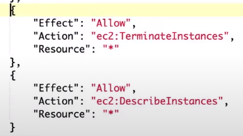

# Chaos Monkey Solution

> Chaos Monkey is responsible for randomly terminating instances in production to ensure that engineers implement their services to be resilient to instance failures. Chaos Monkey is a tool developed at Netflix that randomly shuts down instances, services,... in production environments (but only during business hours) to ensure their services are still up and running in case of failures.
This tool is developed according to Principles of Chaos Engineering (http://principlesofchaos.org) because no one can guarantee any service, component has 100% uptime. And doing chaos engineering helps us to know the weak points of the system that can lead to failures and build recovery solutions automatically without having to deal with 3AM.

* Workflow:

    
* Lambda need these permission

    